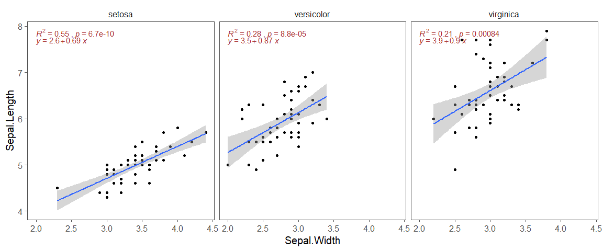

## 1. Using rstatix do quick calculation

``` r
library(tidyverse)
library(rstatix)

iris %>%
  group_by(Species) %>%
  cor_test(Sepal.Width, Sepal.Length, method = "pearson")
```

    ## # A tibble: 3 × 9
    ##   Species    var1       var2    cor statistic        p conf.low conf.high method
    ##   <fct>      <chr>      <chr> <dbl>     <dbl>    <dbl>    <dbl>     <dbl> <chr> 
    ## 1 setosa     Sepal.Wid… Sepa…  0.74      7.68 6.71e-10    0.585     0.846 Pears…
    ## 2 versicolor Sepal.Wid… Sepa…  0.53      4.28 8.77e- 5    0.290     0.702 Pears…
    ## 3 virginica  Sepal.Wid… Sepa…  0.46      3.56 8.43e- 4    0.205     0.653 Pears…

## Correlation add R2 and slope

``` r
bdims_summary <- iris %>%
  group_by(Species) %>%
  summarize(N = n(), r = cor(Sepal.Width, Sepal.Length),
            mean_hgt = mean(Sepal.Width), 
            mean_wgt = mean(Sepal.Length),
            sd_hgt = sd(Sepal.Width), 
            sd_wgt = sd(Sepal.Length),
            slope = r*(sd_wgt/sd_hgt),
            intercept = mean_wgt - (slope*mean_hgt),
            r2 = r*r)

bdims_summary
```

    ## # A tibble: 3 × 10
    ##   Species        N     r mean_hgt mean_wgt sd_hgt sd_wgt slope intercept    r2
    ##   <fct>      <int> <dbl>    <dbl>    <dbl>  <dbl>  <dbl> <dbl>     <dbl> <dbl>
    ## 1 setosa        50 0.743     3.43     5.01  0.379  0.352 0.690      2.64 0.551
    ## 2 versicolor    50 0.526     2.77     5.94  0.314  0.516 0.865      3.54 0.277
    ## 3 virginica     50 0.457     2.97     6.59  0.322  0.636 0.902      3.91 0.209

## Plot

``` r
ggplot(iris, aes(x = Sepal.Width, y = Sepal.Length)) +
  geom_point() +
  geom_smooth(method = "lm") +
  facet_wrap(~Species) + 
  ggthemes::theme_few(base_size = 15) +
  ggpubr::stat_cor(aes(label = paste(after_stat(rr.label), p.label, sep = "~ `,`~")), color = "brown", label.y.npc = 1) +
  ggpubr::stat_regline_equation(color = "brown", label.y.npc = 0.95) 
```



``` r
ggplot(iris, aes(x = Sepal.Width, y = Sepal.Length)) +
  geom_point() +
  geom_smooth(method = "lm") +
  facet_wrap(~Species) + 
  ggthemes::theme_few(base_size = 15) +
  ggpubr::stat_cor(aes(label = paste(after_stat(rr.label), p.label, sep = "~ `,`~")), color = "brown", label.y.npc = 1) +
  ggpubr::stat_regline_equation(color = "brown", label.y.npc = 0.95) 
```


